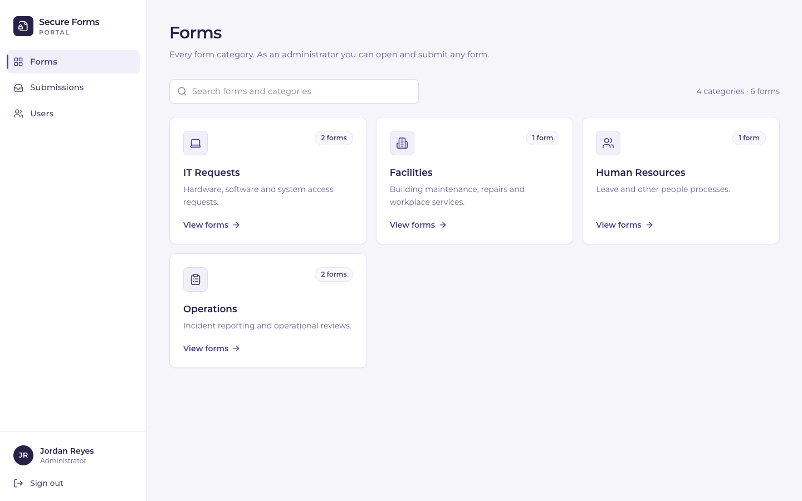
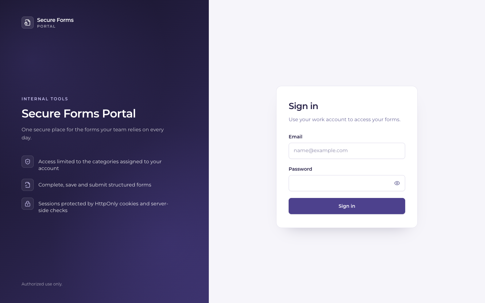
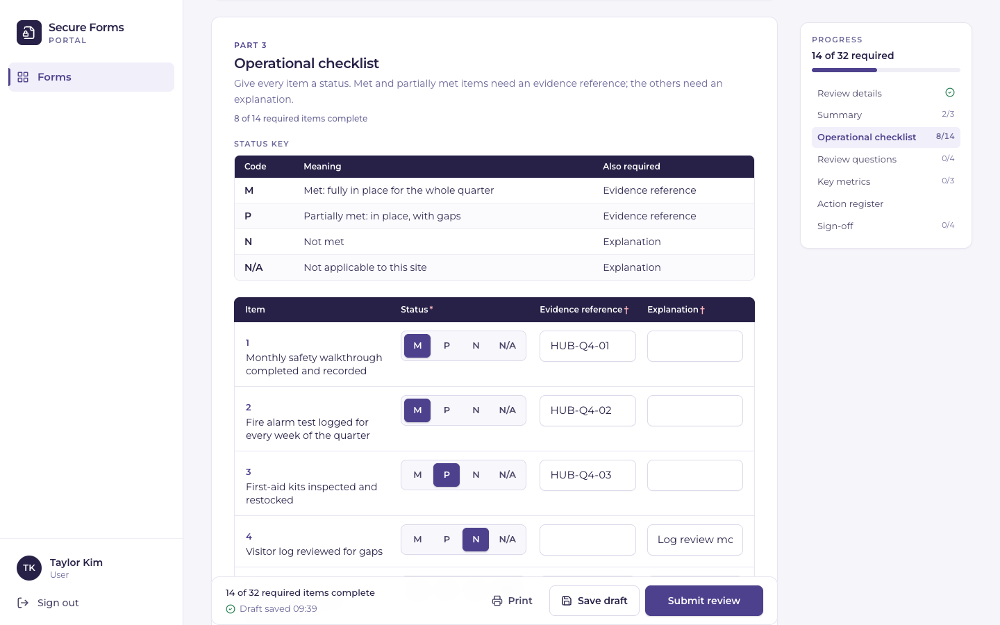
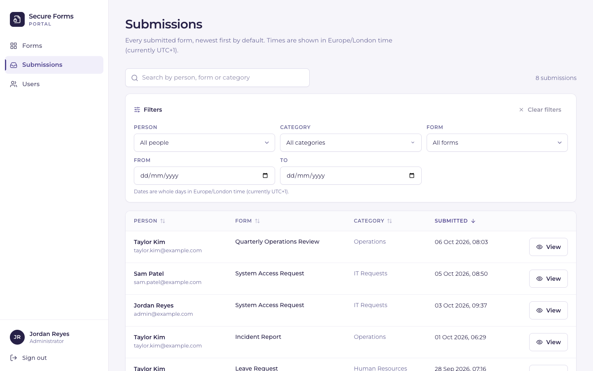
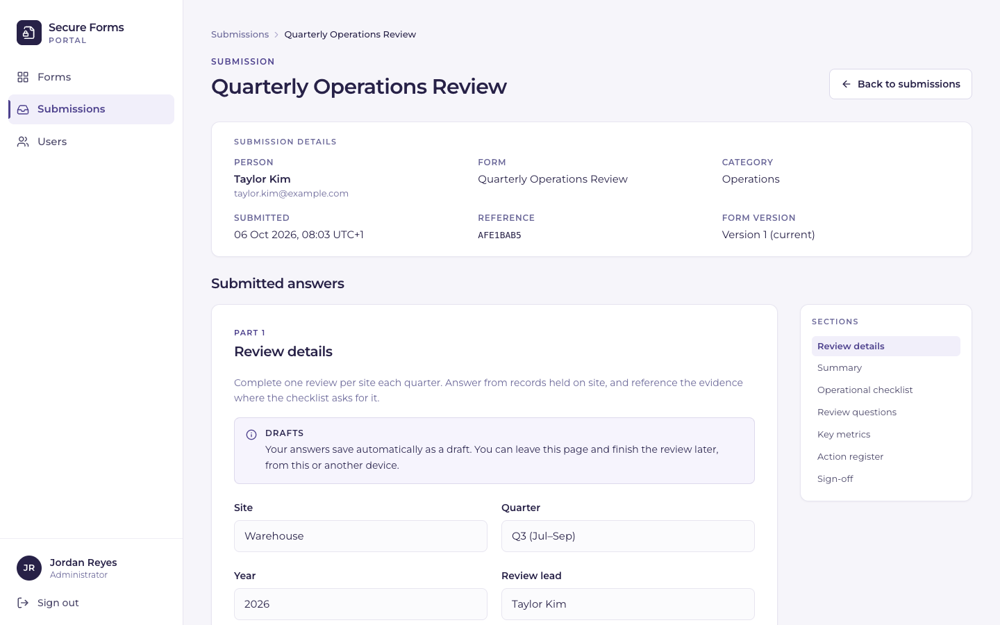
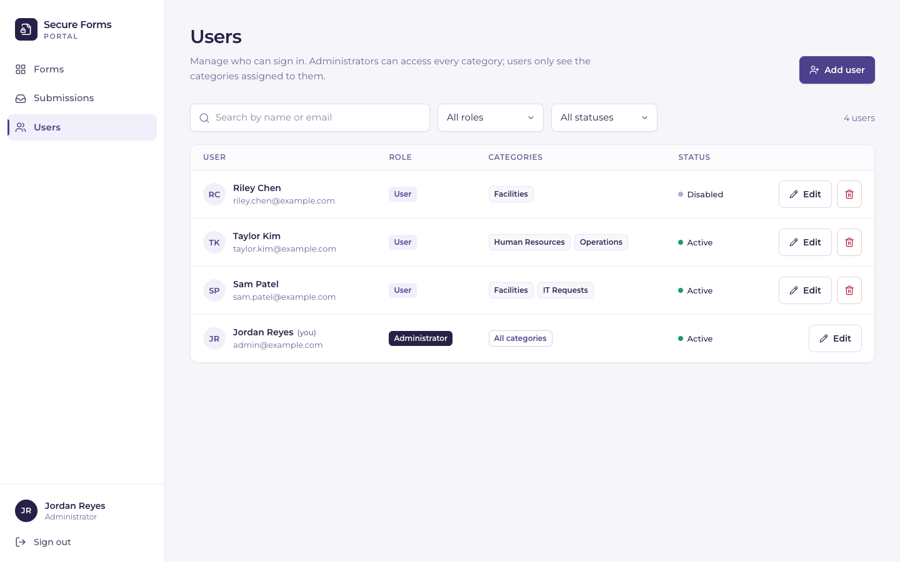
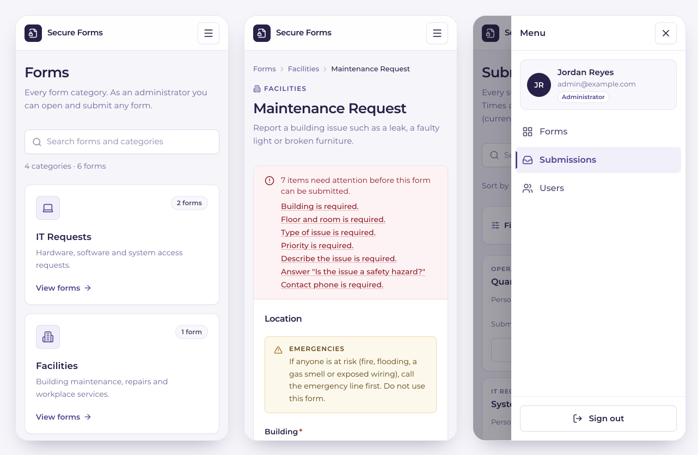

# Secure Forms Portal

A secure, schema-driven internal forms portal built with Next.js, TypeScript and SQLite.

Organisations often collect operational information (equipment requests, incident reports, leave
requests, periodic reviews) through scattered documents and spreadsheets, with no access control and
no reliable record of who submitted what. Secure Forms Portal gives staff one place to fill in those
forms, limits each person to the form categories they are responsible for, keeps long forms as
server-side drafts, and gives administrators a searchable record of every submission.

This is a **standalone reference implementation of an internal tool**, not a hosted SaaS product. It
shows how such an application can be structured end to end: forms defined as typed data, one shared
renderer, validation shared by browser and server, authorization enforced on the server, and a small
but complete security model. All demo content is fictional.



**Tech stack:** Next.js 14 (App Router) · React 18 · TypeScript (strict) · Tailwind CSS 3 ·
SQLite via `better-sqlite3` · Node.js `crypto` (scrypt, random tokens) · `lucide-react` icons ·
Montserrat · Vitest · Playwright with axe-core. No external authentication or form-builder libraries.

## Contents

- [Screenshots](#screenshots)
- [Features](#features)
- [Getting started](#getting-started)
- [Demo data](#demo-data)
- [Roles and permissions](#roles-and-permissions)
- [Architecture](#architecture)
- [Project structure](#project-structure)
- [The form schema](#the-form-schema)
- [Adding a new form](#adding-a-new-form)
- [Security](#security)
- [Database](#database)
- [Environment variables](#environment-variables)
- [Testing](#testing)
- [Known limitations](#known-limitations)
- [Possible future work](#possible-future-work)
- [License](#license)

---

## Screenshots

All screenshots show the fictional demo data.

| Sign in | Long form with drafts and progress |
| --- | --- |
|  |  |
| **Submissions (administrator)** | **Submission detail** |
|  |  |
| **User management** | **Phones: dashboard, validation, navigation** |
|  |  |

---

## Features

**Authentication and access**
- Email and password sign-in with database-backed sessions.
- Two roles, *administrator* and *user*. Users only see and use the form categories assigned to them.
- Every permission is enforced on the server (pages, API routes and queries), not by hiding UI.

**Schema-driven forms**
- Each form is a typed `FormSchema` in code. The same schema drives the UI, browser validation and
  server validation, so a new form needs no page, API route or migration.
- 14 field types: `text`, `email`, `tel`, `textarea`, `signature` (typed name), `number`, `date`,
  `time`, `datetime`, `select`, `radio`, `checkboxes`, `checkbox`, plus two composite types:
  - `table`: fixed rows with the same input columns, in *cards*, *grid* or numbered *list* layouts;
  - `repeater`: a register of rows the user adds and removes, optionally with generated identifiers (`ACT-01`).
- Read-only content blocks: paragraph, callout, list, static table and facts.
- Conditional requirements: a field required when a choice field has certain values; a table cell
  required by another cell in its row; columns required in specific rows only.
- Three render modes from the same components: *fill*, *preview* and read-only *review*.

**Long forms and drafts**
- Section navigation, per-section progress of required items, a sticky action bar and print.
- Server-side drafts (one per user and form): debounced autosave, manual save, restore on return,
  discard, and an unsaved-changes guard on reload and in-app navigation.
- Two-tab conflict handling: a save based on an outdated draft is refused, and the user chooses
  between loading the saved version and keeping the answers on the page.

**Submissions**
- Stored with the authenticated user, form, category, normalised answers and a server timestamp,
  with the user's draft removed in the same transaction. A reference number is shown on success.
- **Form versioning**: when a form's schema changes, a new version is recorded. Each submission keeps
  the version it was validated against and is always displayed with the questions that were answered.

**Administration**
- Submissions list: filters by person, category, form and date range (combined with AND, kept in the
  URL, applied in SQL), plus search, sorting and a result count. Detail view renders every answer in review mode.
- User management: search, role and status filters, add, edit, enable/disable, remove, category
  assignment and password reset, with a **Generate password** button (Web Crypto, in the browser).
- Lock-out safeguards: administrators can't demote or disable themselves, at least one active
  administrator always remains, and users with submissions can be disabled but not deleted.

**Interface**
- Responsive: fixed 264px sidebar on desktop; sticky top bar with a right-side drawer on phones and
  tablets; tables become cards and dialogs become bottom sheets on small screens.
- Accessible: labelled controls, keyboard support, focus management in dialogs and drawers, skip
  link and live regions, checked with axe in the browser tests.
- Timestamps shown in a configurable time zone (`PORTAL_TIMEZONE`).

---

## Getting started

### Prerequisites

- Node.js **20.9 or later** and npm.
- `better-sqlite3` is a native module; npm downloads a prebuilt binary for common platforms.
- For the browser tests only: Google Chrome installed locally (see [Testing](#testing)).

### 1. Install dependencies

```bash
npm install
```

### 2. Create your local environment file

```bash
cp .env.example .env.local
```

`.env.local` is git-ignored. Every variable is documented in [`.env.example`](.env.example) and in
[Environment variables](#environment-variables).

### 3. Configure it

To explore the app with demo data, set these two values in `.env.local`:

```bash
PORTAL_SEED_DEMO=true
PORTAL_DEMO_PASSWORD=<choose a password of at least 10 characters>
```

There is deliberately no default demo password: you choose one locally and it never appears in the
repository. Alternatively, create a real first administrator with `PORTAL_BOOTSTRAP_ADMIN_EMAIL` and
`PORTAL_BOOTSTRAP_ADMIN_PASSWORD` (see [Environment variables](#environment-variables)).

### 4. Start the development server

```bash
npm run dev
```

Open <http://localhost:3000> and sign in, for example as `admin@example.com` with the password you
set in `12345`.

On the first request the app creates `.data/portal.sqlite`, applies the migrations, syncs the form
catalog and, when enabled, adds the demo data. To start over, stop the server and delete the `.data/` folder.

### 5. Production build

```bash
npm run build
npm start          # http://localhost:3000
```

### 6. Checks and tests

```bash
npm run typecheck  # TypeScript
npm run lint       # ESLint
npm test           # Vitest unit and integration tests
npm run check      # all three of the above

npm run build      # required before the browser tests
npm run test:e2e   # Playwright browser tests (desktop and mobile)
```

See [Testing](#testing) for what each suite covers.

---

## Demo data

Demo data is created **only** when `PORTAL_SEED_DEMO=true` **and** `PORTAL_DEMO_PASSWORD` is set
(at least 10 characters). If the password is missing or too short, nothing is created and a warning is
logged. Every demo account uses that password. Seeding is idempotent and intended for local
development only.

**Users** (all on the reserved `example.com` domain):

| Email | Role | Access |
| --- | --- | --- |
| `admin@example.com` (Jordan Reyes) | Administrator | Everything |
| `sam.patel@example.com` (Sam Patel) | User | IT Requests, Facilities |
| `taylor.kim@example.com` (Taylor Kim) | User | Human Resources, Operations |
| `riley.chen@example.com` (Riley Chen) | User, **disabled** | Facilities. Cannot sign in; has a submission, so it can be disabled but not removed |

**Categories and forms** (defined in [`lib/catalog/`](lib/catalog), always present):

| Category | Form | Demonstrates |
| --- | --- | --- |
| IT Requests | Equipment Request | Basic inputs, number limits, "Other" → required follow-up, declaration checkbox |
| IT Requests | System Access Request | Checkbox selection limit, date-time, conditional justification, typed signature |
| Facilities | Maintenance Request | Warning callout, time inputs, choices with descriptions, footer list |
| Human Resources | Leave Request | Facts block, decimal numbers, conditional text, signature |
| Operations | Incident Report | A repeater that becomes required when someone was injured |
| Operations | Quarterly Operations Review | The long form: navigation, drafts, grid/cards/list tables, register with generated IDs, row-level sign-off |

**Submissions:** eight sample submissions spread over the previous weeks, created only on an
empty database and validated against the real schemas like any browser submission.

---

## Roles and permissions

| Capability | Administrator | User |
| --- | :---: | :---: |
| See and open active categories | All | Assigned only |
| Fill, preview and submit forms; save drafts | All forms | Forms in assigned categories |
| View, filter and read submissions | ✓ | – |
| Manage users and category assignments | ✓ | – |

- **Administrators** have implicit access to every category; category assignments are not stored for them.
- **Users** must have at least one category. Access is inherited from the category, so a user gets
  every active form in an assigned category, including forms added later.
- Permissions are re-read from the database on every request: a role change, category change or
  disabled account takes effect on the user's next request.
- Disabled accounts and unknown roles get nothing (deny by default).
- A user asking for a category they can't access gets the same "Access denied" answer whether or not
  it exists, so category names don't leak.

---

## Architecture

- **Forms as data.** Categories and forms are defined in TypeScript in `lib/catalog/`. On startup each
  schema is checked by `assertValidSchema` and the catalog is upserted into SQLite by slug. Nothing is
  deleted; an entry is retired with `status: "inactive"`. There is intentionally no form-editing UI.
- **One renderer.** `FormRenderer` (fill) and `FormReadOnlyView` (preview and review) share the same
  section, field, table and repeater components; a React context switches the mode.
- **Shared validation.** `validateSubmission(schema, input, mode)` in `lib/forms/validation.ts` runs in
  the browser for instant feedback and on the server as the authority. It normalises values, discards
  unknown keys and reports errors per field (`field.row.column` for cells). Draft mode never fails, so
  partial work is never lost.
- **Server-authoritative authorization.** Middleware adds security headers and redirects requests
  without a session cookie. Every page and API route validates the session against the database, then
  calls a service in `lib/server/` that re-checks the rules in `lib/authz.ts` and queries with
  SQL scoped to the user's categories. Client components only receive data that is already authorised.
- **SQLite.** One local database file via `better-sqlite3`, with versioned migrations, prepared
  statements and transactions. All SQL lives in `lib/server/`.
- **Form versioning.** Catalog sync hashes each schema; a changed schema becomes a new row in
  `form_versions` and the form's current version. Submissions reference their version.

## Project structure

```
app/
  (app)/                 Authenticated pages: /forms, /forms/[category], /forms/[category]/[form],
                         …/view (preview), /submissions, /submissions/[id], /users, shared layout
  login/                 Sign-in page
  api/                   JSON API: auth/{login,logout,session}, forms (+ draft, submissions), submissions, users
components/
  forms/                 FormRenderer, FormReadOnlyView, draft hook, renderer/ (fields, tables, sections)
  catalog/               Dashboard and category views
  submissions/           Submissions list, filters, combobox
  users/                 Users page, add/edit and remove dialogs
  shell/  auth/  ui/     App shell and navigation, login form, shared UI primitives
lib/
  forms/                 Schema types, shared validation, schema checks, progress
  catalog/               Demo catalog: categories and one file per form
  server/                Server-only code: database and migrations, sessions, authentication,
                         rate limiting, catalog/user/submission/draft services, demo seed, settings
  authz.ts               Authorization rules
  users/                 Shared user validation, browser password generator
  submissions/           Shared submission filter parsing
  config.ts  time.ts     Shared constants, safe redirects, time-zone formatting
middleware.ts            Security headers (CSP, HSTS, …) and the no-cookie gate
tests/                   Vitest unit and integration tests (in-memory SQLite)
e2e/                     Playwright browser tests
docs/screenshots/        README screenshots
```

---

## The form schema

```ts
type FormSchema = {
  version: 1;                 // schema format version
  navigation?: boolean;       // long-form layout + server-side drafts
  submitLabel?: string;
  sections: Array<{
    id?: string; eyebrow?: string; title?: string; description?: string;
    content?: ContentBlock[]; // shown before the fields
    fields: FormField[];
    footer?: ContentBlock[];  // shown after the fields
  }>;
};
```

Every field has `name`, `label` and optionally `required`, `requiredWhen`, `helpText`, `placeholder`
and `width: "half" | "full"`, plus type-specific options:

| Type | Options |
| --- | --- |
| `text` `email` `tel` `textarea` `signature` | `minLength`, `maxLength` |
| `number` | `min`, `max`, `step` (1 = whole numbers) |
| `date` `time` `datetime` | `min`, `max` (same format as the value) |
| `select` `radio` | `options: { value, label, description? }[]` |
| `checkboxes` | `options`, `minSelected`, `maxSelected` |
| `checkbox` | `required` means it must be ticked |
| `table` | `rows`, `columns`, `layout: "cards" \| "grid" \| "list"`, `rowHeader` |
| `repeater` | `columns`, `maxRows`, `initialRows`, `minRows`, `rowLabel: { prefix, pad }`, `itemLabel` |

Conditional requirements:

```ts
// A field required while another choice field (select, radio or checkboxes) holds one of the values.
{ name: "hazardDetails", type: "textarea", label: "Hazard details",
  requiredWhen: { field: "hazard", values: ["yes"], message: "Describe the hazard." } }

// A table cell required by another cell of the same row.
{ key: "evidence", label: "Evidence reference", input: { type: "text" },
  requiredWhen: { column: "status", values: ["M", "P"] } }

// Cells required in one row only.
rows: [{ key: "prepared", label: "Prepared by", requiredColumns: ["name", "signature"] }]
```

Answers are stored as JSON: scalars by field name, tables as `{ [rowKey]: { [columnKey]: value } }`,
and repeaters as arrays of rows (trailing blank rows dropped; generated identifiers stored in `id`).

## Adding a new form

1. Create `lib/catalog/forms/my-form.ts` exporting a `CatalogForm` (`slug`, `name`, `description`, `schema`).
2. Add it to a category's `forms` array in `lib/catalog/demo-catalog.ts` (array order is display order).
   A new category needs a `slug`, `name`, `description` and an `icon` key from
   `components/catalog/CategoryIcon.tsx`.
3. Run `npm test`. The catalog test validates every schema, and the app refuses to start with an invalid one.
4. Restart the app. The form is synced by slug. Changing its schema later records version 2, and
   existing submissions keep displaying with version 1.

---

## Security

**Passwords**
- Hashed with **scrypt** (N=2¹⁵, r=8, p=1) and a **random 16-byte salt per password**, compared in
  constant time. The stored format includes its parameters, so they can be raised later.
- Generated passwords are created in the browser with the Web Crypto API, shown once to copy, sent
  only with the save request and hashed on the server. Plaintext passwords are never stored.

**Sessions**
- A random 256-bit token in a cookie that is **HttpOnly**, **SameSite=Lax**, and **Secure** in
  production (`NODE_ENV=production`, unless `PORTAL_COOKIE_SECURE=false`).
- The database stores only the token's **SHA-256 hash**, so a leaked database cannot be replayed as cookies.
- Expires after **12 hours of inactivity** and **7 days** in total.
- **Logout deletes the server-side session.** Disabling an account, resetting its password or
  removing the user revokes its sessions; a disabled account is also refused on its next request.

**Sign-in protection**
- Throttling in a 15-minute window: **5 failures per account** and **30 per IP address**, answered with
  `429` and `Retry-After`. Counters are stored in SQLite behind a small `RateLimiter` interface.
- One **generic error** for an unknown email or a wrong password.
- Unknown emails still run a full scrypt verification against a **dummy hash**, so response timing
  doesn't reveal which accounts exist. A disabled account is only reported after the correct password.

**Requests**
- **Same-origin mutations only**: checked with Fetch Metadata (`Sec-Fetch-Site`), falling back to `Origin`.
- **JSON-only bodies** (`415` otherwise), which cross-site HTML forms cannot send.
- **1 MB request size limit**, enforced while the body is streamed.
- Post-login redirects only accept paths inside the application.

**Authorization and data integrity**
- **Server-side authorization** in pages, API routes and service functions, with category-scoped SQL.
  The administrator check runs before a submission id is looked up.
- **Server-authoritative identity and timestamps**: the user, role, category and submission time
  always come from the session and the server clock. Any such values in a request body are ignored.
- **Last-administrator protection**, checked inside the same `BEGIN IMMEDIATE` transaction as the
  change, so concurrent requests cannot remove the last active administrator.

**HTTP headers**
- **Content-Security-Policy** with a per-request nonce and `strict-dynamic` (no inline script runs
  without the nonce), `frame-ancestors 'none'`, `object-src 'none'`, `base-uri 'self'`, `form-action 'self'`.
- **HSTS** (`max-age=63072000; includeSubDomains`) in production builds.
- `X-Frame-Options`, `X-Content-Type-Options`, `Referrer-Policy`, `Permissions-Policy`,
  `Cross-Origin-Opener-Policy`, `X-Robots-Tag` and `Cache-Control: no-store`.

**Trusted proxies**
- `X-Forwarded-For` can be forged, so it is ignored unless `PORTAL_TRUSTED_PROXY_HOPS` declares how
  many reverse proxies sit in front of the app. The client IP is then read from the entry those
  proxies appended. With the default of `0`, per-IP throttling treats all clients as one source, and a
  warning is logged in production.

---

## Database

SQLite through `better-sqlite3`, opened with WAL journaling, foreign keys, a 5-second busy timeout and
`synchronous=NORMAL`. Migrations live in `lib/server/migrations.ts` and are tracked with
`PRAGMA user_version`; each runs in an `IMMEDIATE` transaction.

| Table | Purpose |
| --- | --- |
| `users` | Accounts; email unique and case-insensitive |
| `categories` | Synced from the catalog |
| `user_categories` | Category assignments |
| `forms` | Synced from the catalog, with the current version number |
| `form_versions` | Every distinct schema of every form |
| `form_submissions` | Answers, user, form, form version, category, server timestamp |
| `form_drafts` | One draft per user and form |
| `sessions` | Token hash, idle and absolute expiry |
| `rate_limits` | Sign-in throttling counters |

Submissions reference users, forms, versions and categories with `ON DELETE RESTRICT`; a removed
user's sessions, category assignments and drafts are deleted with them. In production, put the
database on persistent storage and back up the `.sqlite` file together with its `-wal` file.

## Environment variables

All variables are optional for the app to start. See [`.env.example`](.env.example) for a commented template.

| Variable | Default | Purpose |
| --- | --- | --- |
| `PORTAL_SEED_DEMO` | unset | `true` creates the demo users and sample submissions. Development only. |
| `PORTAL_DEMO_PASSWORD` | unset | Password for every demo account (min. 10 characters). **Required for demo data.** |
| `PORTAL_BOOTSTRAP_ADMIN_EMAIL` | unset | With the password below, creates the first administrator while none exists. |
| `PORTAL_BOOTSTRAP_ADMIN_PASSWORD` | unset | Password for that administrator (min. 10 characters). Remove after first sign-in. |
| `PORTAL_BOOTSTRAP_ADMIN_NAME` | `Administrator` | Display name for that administrator. |
| `PORTAL_DB_PATH` | `.data/portal.sqlite` | SQLite database file. |
| `PORTAL_TIMEZONE` | `UTC` | IANA time zone for displayed times and the submission date filters. |
| `PORTAL_TRUSTED_PROXY_HOPS` | `0` | Number of trusted reverse proxies (0–10), for reading the client IP. |
| `PORTAL_COOKIE_SECURE` | unset | `false` disables the Secure cookie flag in production, for plain-HTTP testing only. |

The browser tests also read two optional variables, `E2E_PORT` (default `3200`) and `E2E_DB`
(default: a new file in the system temp directory).

---

## Testing

| Check | Command | What it covers |
| --- | --- | --- |
| Typecheck | `npm run typecheck` | Whole project, TypeScript strict mode |
| Lint | `npm run lint` | ESLint with `next/core-web-vitals` |
| Production build | `npm run build` | Next.js production build |
| Unit and integration | `npm test` | **102 tests** (Vitest, in-memory SQLite) |
| Browser | `npm run test:e2e` | **26 scenarios × 2 viewports = 52 tests** (Playwright) |

**Vitest** covers validation rules and conditional requirements, tables and repeaters, schema checks
for the whole catalog, authorization rules, safe redirects, time-zone day boundaries (including DST),
password hashing and generation, sessions (hashing, idle and absolute expiry, revocation, permission
reload), sign-in throttling and client-IP parsing, user-management safeguards, scoped catalog queries,
submissions and filters, drafts and conflicts, form versioning and the demo seed.

**Playwright** runs every scenario on a 1440px desktop and on a Pixel 7 phone viewport:
sign-in and sign-out (including replaying a revoked session cookie), security headers, role and
category enforcement through pages and the API, form validation and submission, server-side
rejection of tampered payloads, drafts (save, autosave, restore, two-tab conflict, discard,
save-on-leave), a complete long-form submission, submission filters, search, sorting and detail,
user management from creation to removal, and fresh data after returning to a page by link or by
browser back/forward when it changed in the same or another session. Each page tested is also checked for:

- **accessibility** with axe-core (WCAG 2.1 A and AA rules);
- **horizontal overflow** (the page must not scroll sideways);
- **console errors** and uncaught exceptions (for example hydration or CSP problems).

Running the browser tests:

```bash
npm run build       # the tests run against the production build
npm run test:e2e
```

The suite starts `next start` on port 3200 with a fresh temporary database and its own throwaway demo
password, so it doesn't touch your `.data/` folder. It uses the locally installed **Google Chrome**
(`channel: "chrome"` in `playwright.config.ts`); if Chrome isn't installed, `npx playwright install chrome` installs it.

---

## Known limitations

These are deliberate scope boundaries of this reference implementation:

- **Single-server storage.** SQLite suits one server. Several instances on different hosts would need
  a shared database and a shared rate-limit store (the `RateLimiter` interface is the seam for that).
- **No pagination** of the submissions list; filters and search work over the full filtered result.
- **No multi-factor authentication** and **no email-based password reset**. Administrators reset passwords.
- **No cross-field validation** such as "the last day must be after the first day"; the schema
  supports per-field rules and `requiredWhen` conditions only.
- **No file uploads**; forms collect structured data only.
- **No export, editing or deletion of submissions.**
- **No UI for editing forms or categories**; they are defined in code and change through a deploy.

## Possible future work

- Postgres storage and a Redis-backed `RateLimiter` for multi-instance deployments.
- Pagination and CSV export for submissions; an audit log of administrator actions.
- TOTP-based multi-factor authentication.
- Cross-field rules and conditional visibility in the schema.

## License

Released under the [MIT License](LICENSE).
